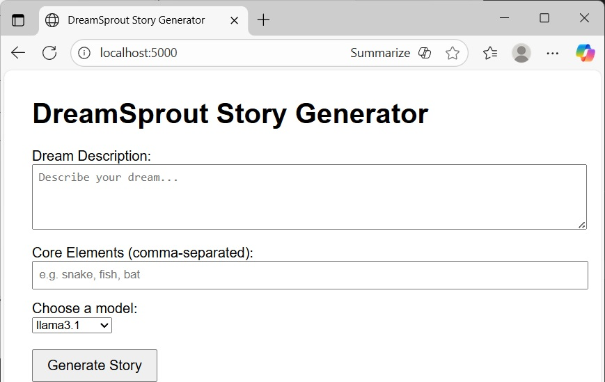
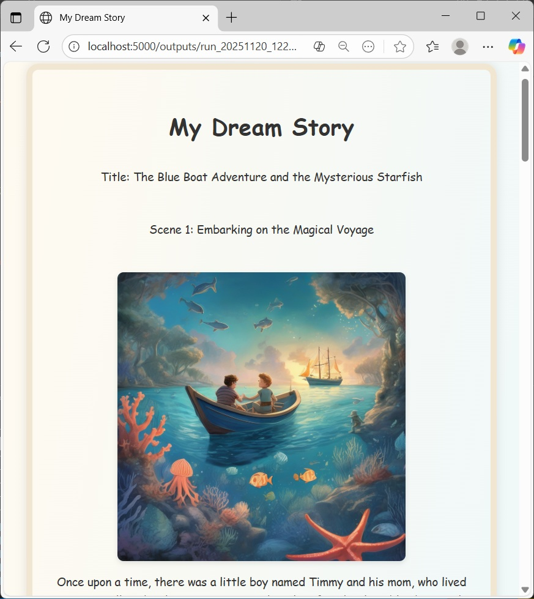
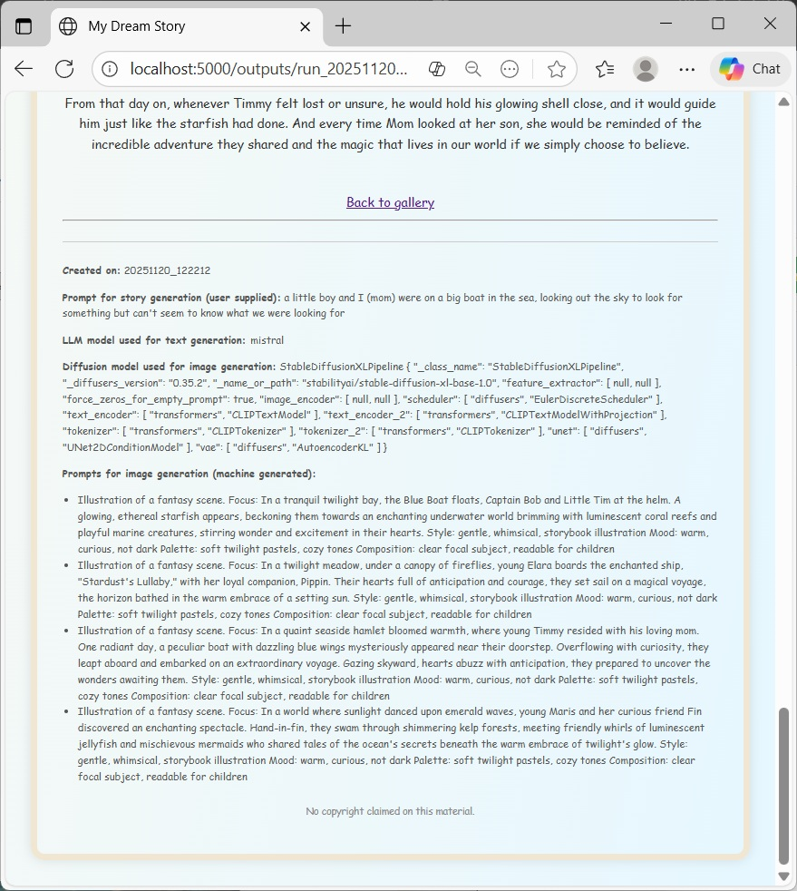

# DreamSprout Story Generator

**DreamSprout** is a fun, educational Python app that transforms a single prompt into a fully illustrated storybook using local large language models (via Ollama) and image generation (via Stable Diffusion XL).

It began with a familiar morning moment: waking up and wondering, “What was that dream about?” **DreamSprout** turns those hazy, half-remembered fragments into surreal and unexpectedly delightful stories. 

Thanks to the quirky nature of language and diffusion models, the results often veer into nonsense, but that’s part of the charm. This unpredictability is a feature, not a bug. It offers a playful, hands-on way to explore how different model architectures and prompt styles shape generative outputs. It's a joyful storytelling tool for parents and children, and also an educational sandbox for understanding the expressive quirks and interpretive boundaries of modern AI.

**Because DreamSprout runs entirely on your local computer, no cloud, no cost, no Internet required, and your privacy is protected.**

Version 1.0, November 20, 2025

---



---



---



---

## Features

- **Model choices**: User can choose local Ollama models (e.g., `llama3.1`, `mistral`). This can be a fun experiment to see different characteristics of open weight models. Models must be installed locally. 
- **Scene Splitting**: Automatically segments stories into scenes and builds image prompts.
- **Image Generation**: Uses HuggingFace diffusers with SDXL to illustrate each scene.
- **Web App**: Flask-based UI for interactive story creation and gallery browsing.
- **HTML Output**: Generates a stylized, child-friendly storybook with prompts, models, and timestamps.
- **CLI Mode**: Run the full pipeline from the command line for testing or automation.
- **Configurable**: Story length and styles can be configured for a variety of storytelling potential.

---

## Project Structure

<pre>
DreamSproutStoryGenerator/
├── config.py               # Model and pipeline configuration
├── dreamsprout.py          # Core story/image generation logic
├── dreamsprout_webapp.py   # Flask app for interactive use
├── model_registry.py       # Registers and manages text/image models
├── ollama_runner.py        # Interfaces with Ollama API
├── outputs/                # Generated HTML and images
└── templates/              # Jinja2 templates for web rendering
    ├── form.html
    ├── gallery.html
    └── storybook_template.html
</pre>

## Requirements

Install dependencies with:

```bash
pip install -r requirements.txt
```

**`requirements.txt`**
```
accelerate==1.11.0
diffusers==0.35.2
Flask==3.1.2
huggingface-hub==0.36.0
Jinja2==3.1.6
requests==2.32.5
safetensors==0.6.2
torch==2.9.0
transformers==4.57.1
xformers==0.0.33.post1
```

### Install Ollama and pull your local model

<pre>
curl -fsSL https://ollama.com/install.sh | sh
ollama serve
ollama pull mistral (or whatever models you want)
</pre>

---

## Usage

### CLI (for testing)

```bash
python dreamsprout.py --prompt "description of your dream here" --elements "a few keywords separated by commas here"
```

This will generate a story, split it into scenes, create illustrations, and render an HTML storybook in `outputs/`.

### Web App

```bash
export FLASK_APP=dreamsprout_webapp.py
flask run
```

Then open [http://localhost:5000](http://localhost:5000) in your browser to:

- Enter a story prompt
- Select a text model
- View and download your generated storybook

---

## License

MIT

---

## 🌈 Created with love to inspire imagination and empower storytellers of all ages.
```


